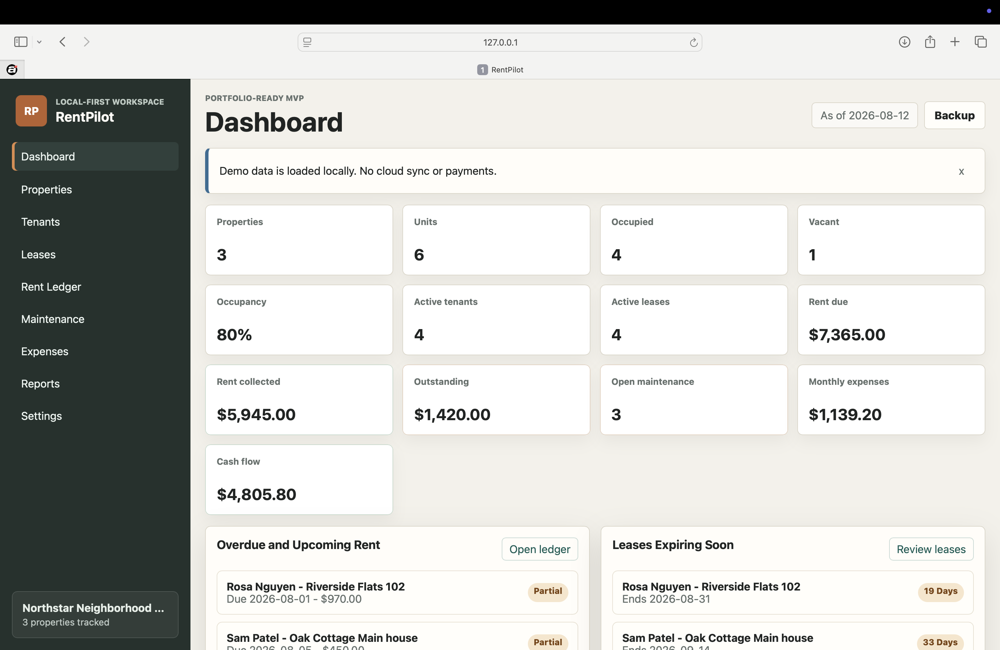
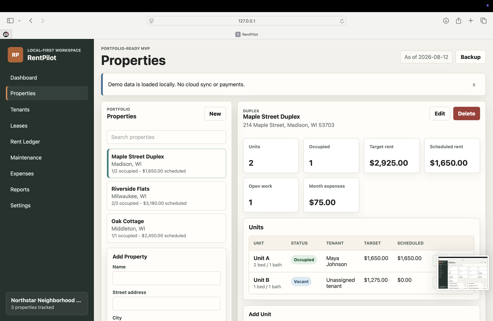
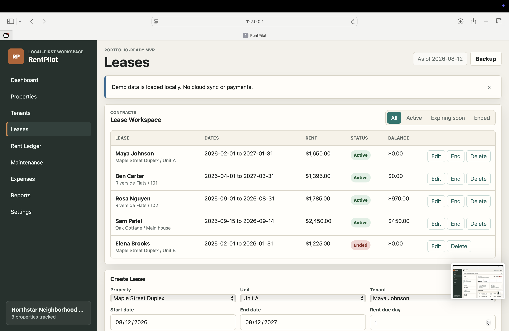
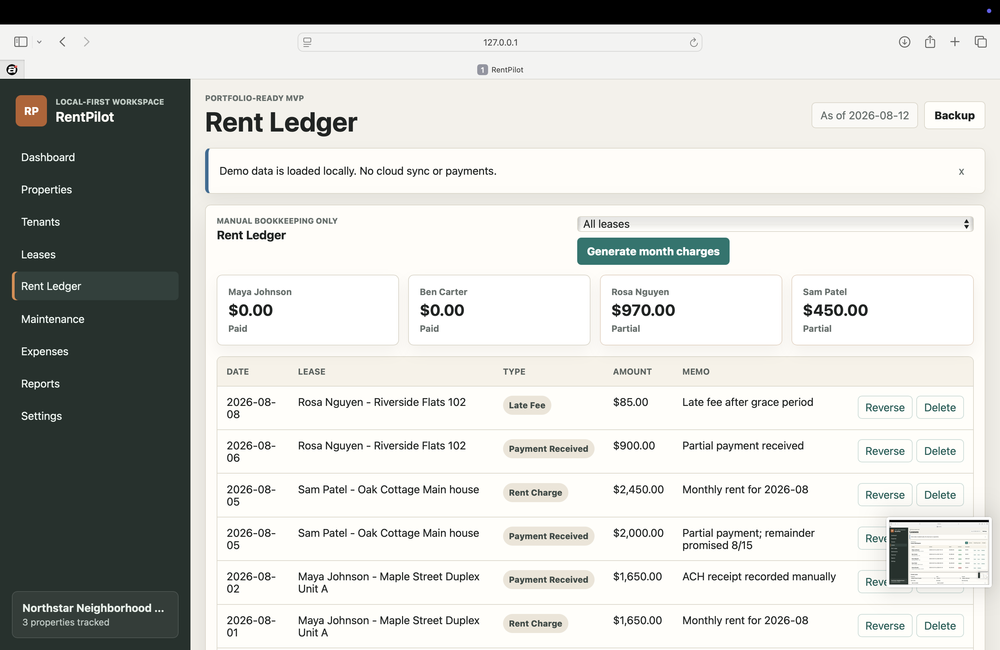
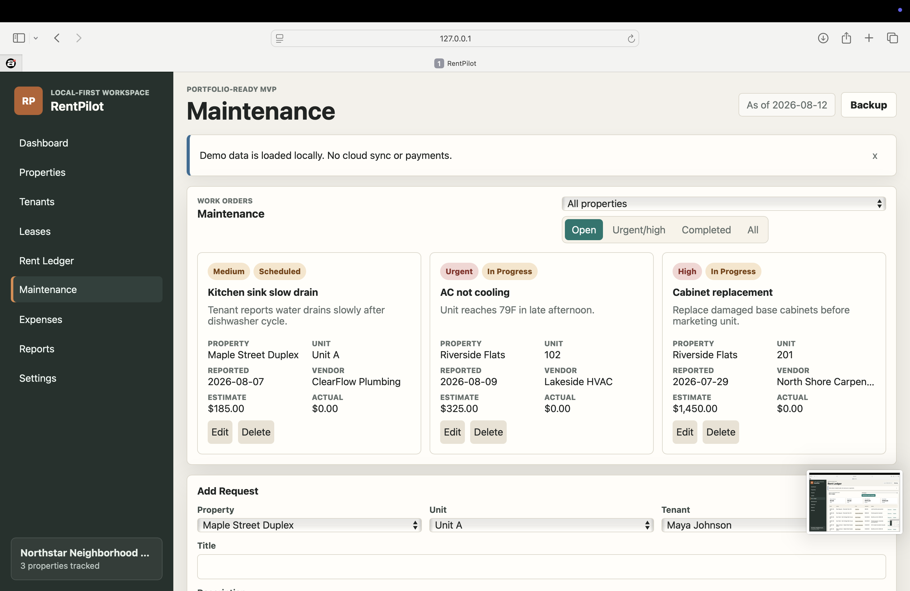
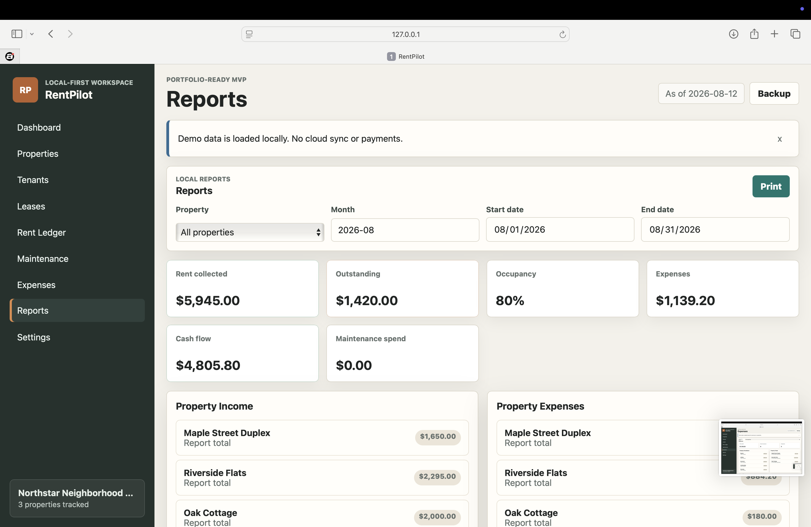

# RentPilot

**Rental property management software for independent landlords and small property managers.**

RentPilot is a local-first business application designed to organize the core property-management workflow in one place:

**Property → Unit → Tenant → Lease → Rent Ledger → Maintenance → Expenses → Reports**

> This repository is a **public product showcase only**. The commercial application source code is kept private.

## Product Preview

## Screenshots

| Properties | Leases |
| --- | --- |
|  |  |

| Rent Ledger | Maintenance |
| --- | --- |
|  |  |

## The Problem

Small landlords and property managers often track leases, rent payments, maintenance, expenses, and tenant history across spreadsheets, notes, messages, and bank records.

RentPilot brings those workflows into one structured workspace so occupancy, balances, maintenance, and cash flow are easier to understand and manage.

## Core Features

- Property and unit management
- Tenant records with balances, payment history, and lease history
- Lease management with active/draft/ended states
- Duplicate active-lease prevention
- Rent ledger for charges, payments, late fees, credits, adjustments, and reversals
- Monthly rent-charge generation
- Maintenance tracking with priority, status, vendor, and cost fields
- Expense tracking by property and category
- Dashboard metrics for occupancy, rent due, rent collected, outstanding balances, open maintenance, monthly expenses, and estimated cash flow
- Reports for rent collected, outstanding balances, occupancy, income, expenses, maintenance spending, and lease expirations
- JSON backup/export and import
- Automated tests around occupancy, lease conflicts, rent ledger logic, balances, reporting, and persistence

## Designed For

- Independent landlords
- Small property managers
- Owners with multiple rental units
- Small residential portfolios
- Local property-management businesses

## Technology

The current web product is built with:

- React
- Vite
- JavaScript
- Plain CSS
- Browser localStorage
- Testable domain modules

A separate React Native mobile companion has also been developed for mobile property-management workflows.

## Product Direction

The current version is intentionally local-first. Future commercial additions could include hosted data, authentication, team accounts, cloud sync, tenant portals, document attachments, automated rent reminders, online payment integrations, accounting integrations, and deeper year-over-year reporting.

## Commercial Use

The complete RentPilot implementation is maintained privately while the product is prepared for commercial licensing and customization.

This repository demonstrates the product interface, workflow design, business logic, and development capabilities without distributing the commercial source code.

## About the Developer

Built by **Amani Robinson**, a React developer focused on business applications, dashboards, workflow tools, CRM-style systems, and operational software.

---

**RentPilot** — one workspace for the day-to-day work of managing rental property.

All rights reserved.
